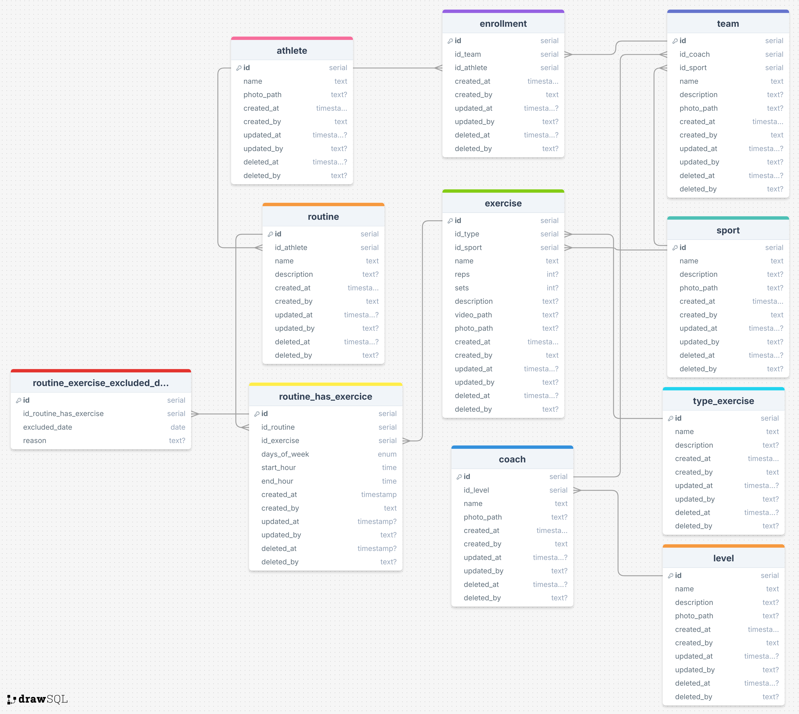

# 🏆 Athletrics

> High-performance athlete management system

[](LICENSE)

## 📋 About the Project

Athletrics is a comprehensive web application for managing high-performance athletes across various sports. The platform enables coaches and athletes to monitor performance, manage training schedules, and analyze data to improve athletic performance.

## ✨ Features

- 👥 **Athlete Management**: Complete athlete registration and tracking
- 🎓 **Coach Management**: Technical team control
- 🏅 **Team Management**: Organization of teams and training groups
- 🏃 **Exercise Management**: Library of exercises and workouts
- ⚽ **Sports Management**: Support for multiple sports modalities
- 📊 **Enrollments and Relationships**: Control of registrations and connections

## 🚀 Technologies Used

### Backend
- **Python 3.x** - Main programming language
- **FastAPI** - Modern and high-performance web framework
- **Supabase** - Backend as a Service (BaaS)
- **PostgreSQL** - Relational database
- **AWS S3** - File storage

### Frontend
- **React** - JavaScript library for UI
- **Vite** - Build tool and dev server
- **React Query** - State management and caching
- **CSS Modules** - Component-scoped styling

### DevOps
- **Docker** - Containerization
- **Nginx** - Web server for frontend

## 📁 Project Structure

```
tcc/
├── backend/              # FastAPI API
│   ├── configs/         # Configuration and environment variables
│   ├── controllers/     # Business logic
│   ├── models/          # Data models (Pydantic)
│   ├── routes/          # API endpoints
│   ├── integrations/    # External integrations (Supabase)
│   ├── utils/           # Utilities (S3, etc)
│   └── public/          # Public files and documentation
│       └── architecture/
│           └── ddl.sql  # Database schema
├── frontend/            # React application
│   ├── src/
│   │   ├── components/ # Reusable components
│   │   ├── pages/      # Application pages
│   │   ├── services/   # API services
│   │   └── hooks/      # Custom hooks
│   └── public/         # Static assets
└── sandbox/            # Test scripts and data
```

## 🏗️ Architecture

### Database Diagram


### Main Entities
- **Athletes**: Athlete information
- **Coaches**: Coach data
- **Teams**: Teams and groups
- **Sports**: Sports modalities
- **Exercises**: Exercise library
- **Enrollments**: Relationships and registrations

## 🔧 Installation and Setup

### Prerequisites
- Python 3.9+
- Node.js 16+
- Docker and Docker Compose (optional)
- Supabase account
- AWS S3 Bucket (optional)

### Backend Setup

1. **Clone the repository**
   ```bash
   git clone https://github.com/lnatamm/tcc.git
   cd tcc/backend
   ```

2. **Create a virtual environment**
   ```bash
   python -m venv venv
   venv\Scripts\activate  # Windows
   # source venv/bin/activate  # Linux/Mac
   ```

3. **Install dependencies**
   ```bash
   pip install -r requirements.txt
   ```

4. **Configure environment variables**
   
   Create a `.env` file in the `backend/` folder with:
   ```env
   SUPABASE_URL=your_supabase_url
   SUPABASE_KEY=your_supabase_key
   AWS_ACCESS_KEY_ID=your_access_key
   AWS_SECRET_ACCESS_KEY=your_secret_key
   AWS_BUCKET_NAME=your_bucket
   ```

5. **Run the server**
   ```bash
   python main.py
   ```

   The API will be available at `http://localhost:8000`

### Frontend Setup

1. **Navigate to the frontend folder**
   ```bash
   cd ../frontend
   ```

2. **Install dependencies**
   ```bash
   npm install
   ```

3. **Configure environment variables**
   
   Create a `.env` file in the `frontend/` folder with:
   ```env
   VITE_API_URL=http://localhost:8000
   ```

4. **Run the development server**
   ```bash
   npm run dev
   ```

   The application will be available at `http://localhost:5173`

### 🐳 Using Docker

```bash
# From the project root
docker-compose up -d
```

## 📚 API Documentation

After starting the backend, access the interactive documentation:

- **Swagger UI**: http://localhost:8000/docs
- **ReDoc**: http://localhost:8000/redoc

## 📖 Additional Guides

- [Integration Guide](INTEGRATION_GUIDE.md) - Detailed integration instructions
- [Database Documentation](backend/README_DB.md) - Schema and structure

## 🤝 Contributing

Contributions are welcome! Feel free to open issues and pull requests.

## 📄 License

This project is licensed under the GNU General Public License v3.0. See the [LICENSE](LICENSE) file for more details.

## 👥 Authors

- **Levi Natã** - [@lnatamm](https://github.com/lnatamm)

## 📞 Contact

For questions or suggestions, please reach out through GitHub issues.

---

Developed with ❤️ for high-performance athlete management